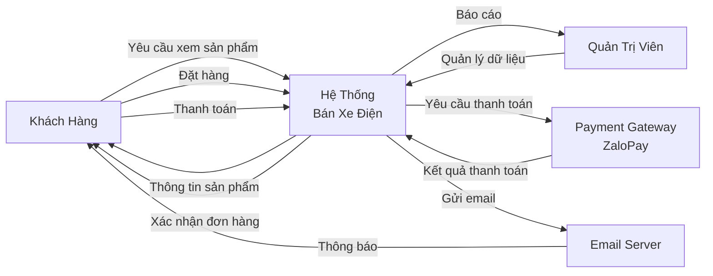
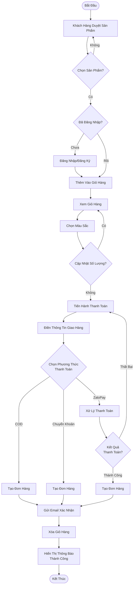
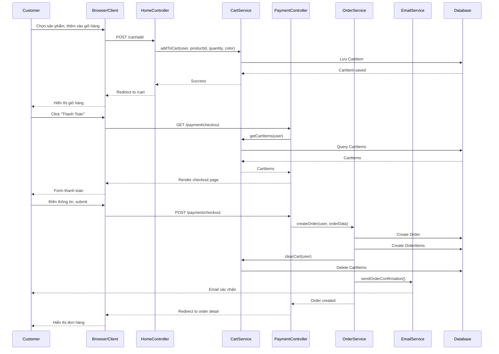
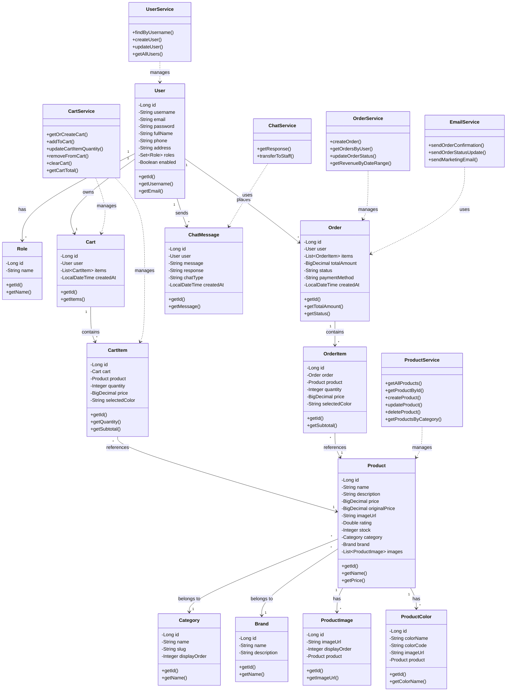
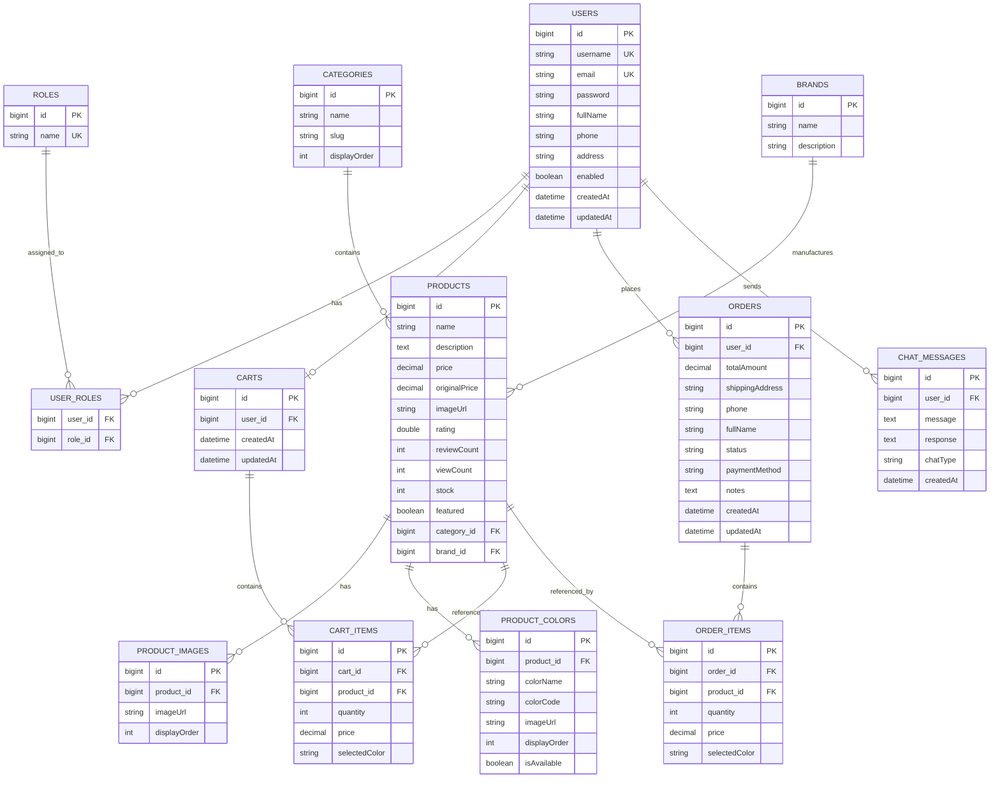
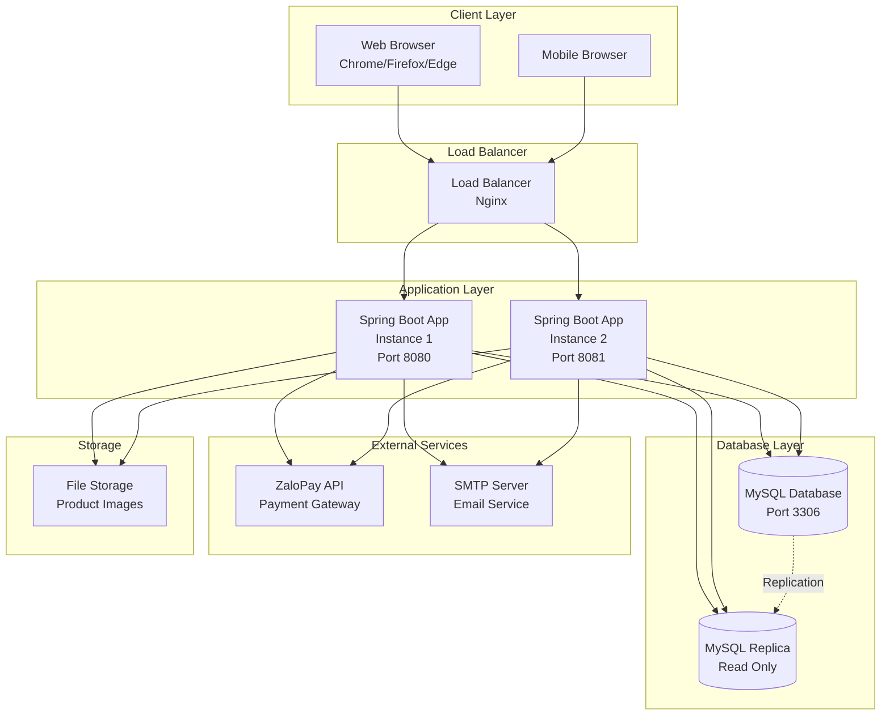

# Sơ Đồ Hệ Thống - Website Bán Xe Điện

## 1. Use Case Diagram (Tổng Quan Chức Năng)

```mermaid
graph TB
    subgraph "Actors"
        Guest[Khách Hàng<br/>Chưa Đăng Nhập]
        Customer[Khách Hàng<br/>Đã Đăng Nhập]
        Admin[Quản Trị Viên]
    end
    
    subgraph "Use Cases - Khách Hàng"
        UC1[Xem Danh Sách Sản Phẩm]
        UC2[Tìm Kiếm Sản Phẩm]
        UC3[Xem Chi Tiết Sản Phẩm]
        UC4[So Sánh Sản Phẩm]
        UC5[Đăng Ký Tài Khoản]
        UC6[Đăng Nhập]
        UC7[Thêm Vào Giỏ Hàng]
        UC8[Xem Giỏ Hàng]
        UC9[Cập Nhật Giỏ Hàng]
        UC10[Đặt Hàng]
        UC11[Xem Đơn Hàng]
        UC12[Quản Lý Thông Tin Cá Nhân]
        UC13[Chat với AI]
        UC14[Chat với Nhân Viên]
        UC15[Kiểm Tra Bảo Hành]
    end
    
    subgraph "Use Cases - Quản Trị"
        UC16[Quản Lý Sản Phẩm]
        UC17[Quản Lý Danh Mục]
        UC18[Quản Lý Thương Hiệu]
        UC19[Quản Lý Đơn Hàng]
        UC20[Xem Doanh Thu]
        UC21[Quản Lý Người Dùng]
        UC22[Gửi Email Marketing]
        UC23[Quản Lý Live Chat]
    end
    
    Guest --> UC1
    Guest --> UC2
    Guest --> UC3
    Guest --> UC4
    Guest --> UC5
    Guest --> UC6
    Guest --> UC13
    Guest --> UC15
    
    Customer --> UC1
    Customer --> UC2
    Customer --> UC3
    Customer --> UC4
    Customer --> UC7
    Customer --> UC8
    Customer --> UC9
    Customer --> UC10
    Customer --> UC11
    Customer --> UC12
    Customer --> UC13
    Customer --> UC14
    Customer --> UC15
    
    Admin --> UC16
    Admin --> UC17
    Admin --> UC18
    Admin --> UC19
    Admin --> UC20
    Admin --> UC21
    Admin --> UC22
    Admin --> UC23
```

## 2. DFD (Data Flow Diagram) - Mức 0 (Context Diagram)

## 3. Activity Diagram - Quy Trình Đặt Hàng

## 4. Sequence Diagram - Đặt Hàng

## 5. Class Diagram

## 6. Database Diagram (ERD)

## 7. Deployment Diagram

## Mô Tả Chi Tiết Các Sơ Đồ

### 1. Use Case Diagram
- **Actors**: Khách hàng chưa đăng nhập, Khách hàng đã đăng nhập, Quản trị viên
- **Use Cases**: Các chức năng chính của hệ thống được phân loại theo từng actor

### 2. DFD (Data Flow Diagram)
- Mô tả luồng dữ liệu giữa các thành phần chính: Khách hàng, Admin, Hệ thống, Payment Gateway, Email Server

### 3. Activity Diagram
- Quy trình đặt hàng từ khi khách hàng duyệt sản phẩm đến khi hoàn tất đơn hàng

### 4. Sequence Diagram
- Tương tác giữa các đối tượng trong quá trình đặt hàng: Customer → Controller → Service → Database

### 5. Class Diagram
- Cấu trúc các lớp trong hệ thống, bao gồm Models và Services với các mối quan hệ

### 6. Database Diagram (ERD)
- Cấu trúc database với các bảng và mối quan hệ giữa chúng

### 7. Deployment Diagram
- Kiến trúc triển khai hệ thống với Load Balancer, Application Servers, Database, và các dịch vụ bên ngoài

