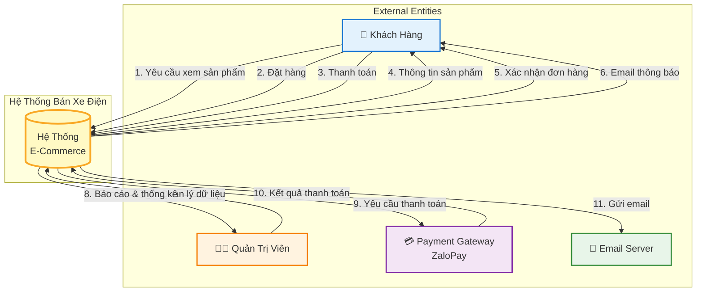
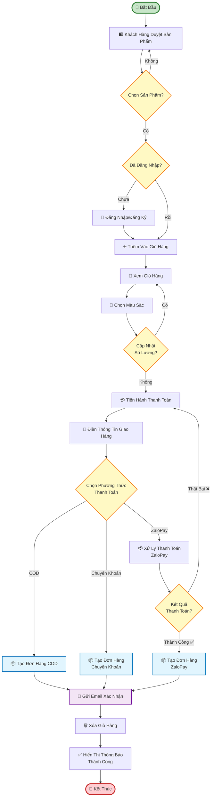
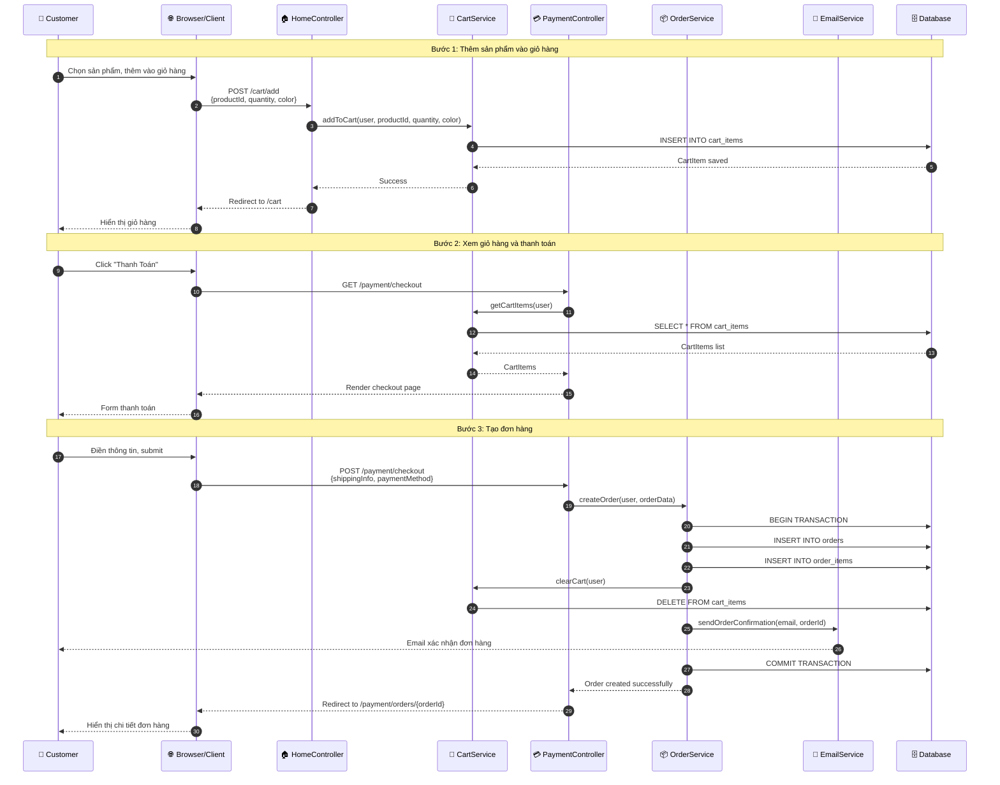
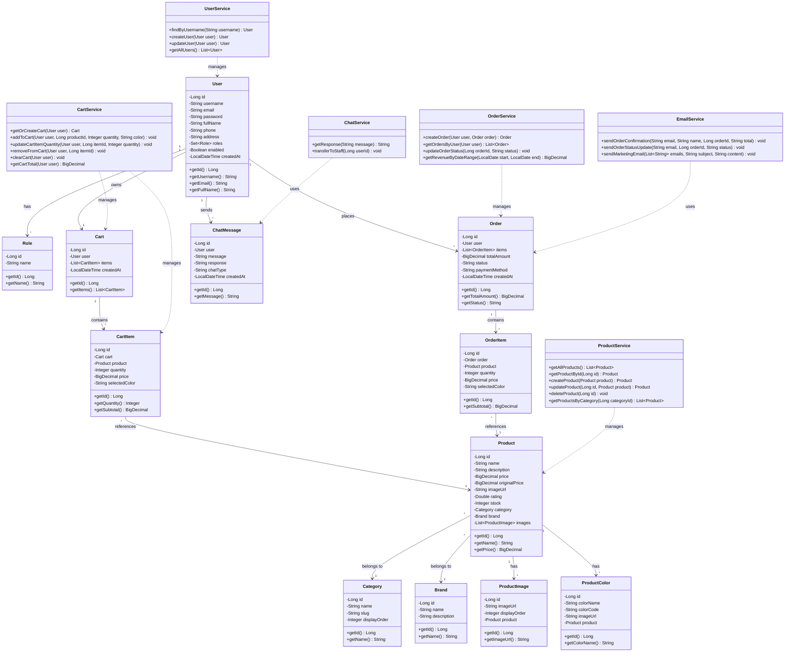
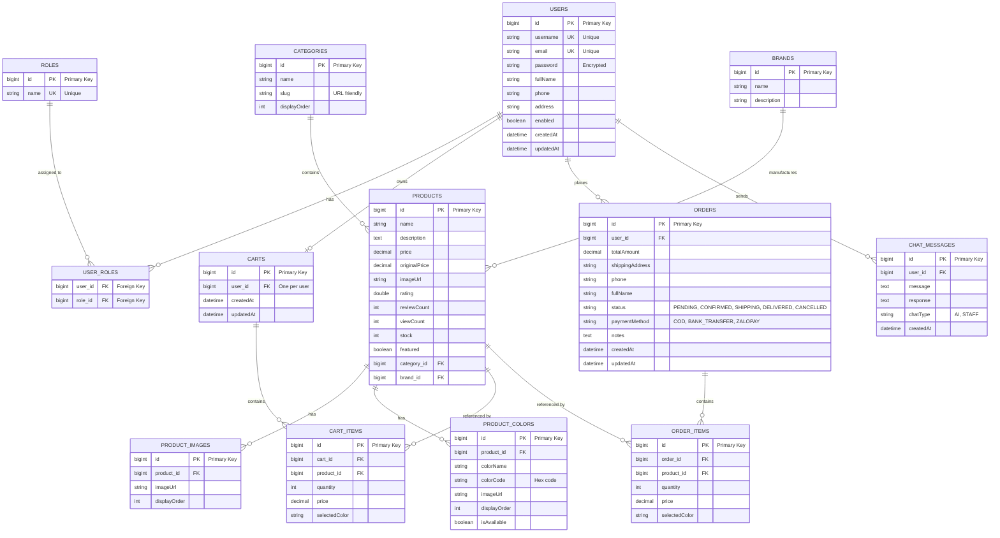
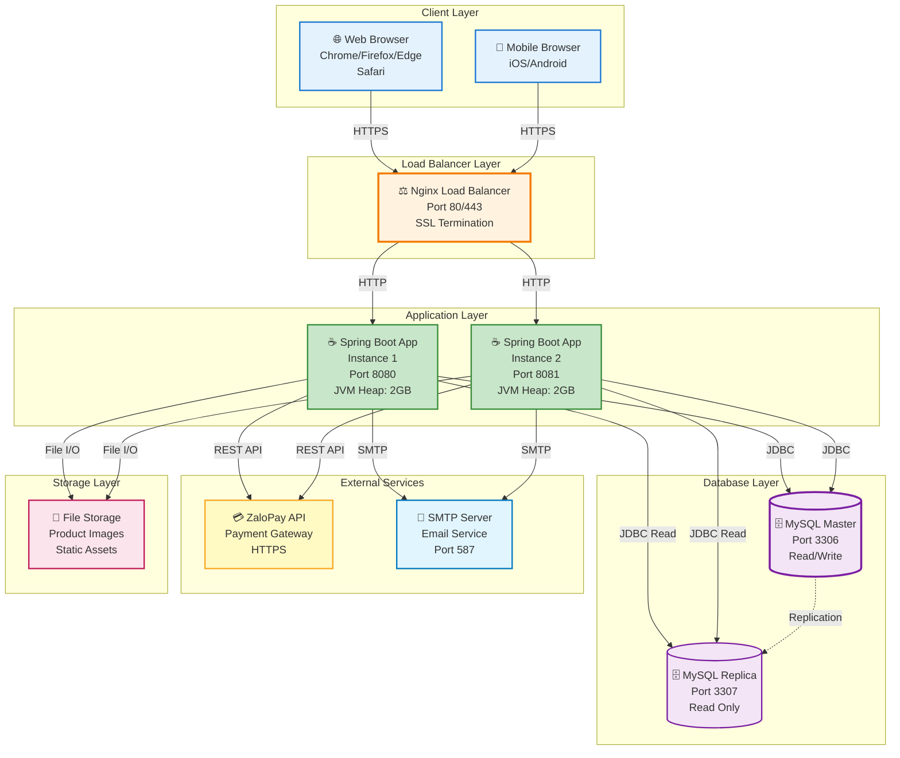

# Sơ Đồ Hệ Thống - Website Bán Xe Điện

## 1. Use Case Diagram (Tổng Quan Chức Năng)

```mermaid
graph TB
    subgraph Actors[" "]
        direction TB
        Guest[👤 Khách Hàng<br/>Chưa Đăng Nhập]
        Customer[👤 Khách Hàng<br/>Đã Đăng Nhập]
        Admin[👨‍💼 Quản Trị Viên]
    end
    
    subgraph GuestUC["Chức Năng Khách Chưa Đăng Nhập"]
        direction TB
        UC1[📋 Xem Danh Sách Sản Phẩm]
        UC2[🔍 Tìm Kiếm Sản Phẩm]
        UC3[👁️ Xem Chi Tiết Sản Phẩm]
        UC4[⚖️ So Sánh Sản Phẩm]
        UC5[📝 Đăng Ký Tài Khoản]
        UC6[🔐 Đăng Nhập]
        UC13[💬 Chat với AI]
        UC15[🛡️ Kiểm Tra Bảo Hành]
    end
    
    subgraph CustomerUC["Chức Năng Khách Hàng"]
        direction TB
        UC7[🛒 Thêm Vào Giỏ Hàng]
        UC8[🛍️ Xem Giỏ Hàng]
        UC9[✏️ Cập Nhật Giỏ Hàng]
        UC10[💰 Đặt Hàng]
        UC11[📦 Xem Đơn Hàng]
        UC12[👤 Quản Lý Thông Tin]
        UC14[👥 Chat với Nhân Viên]
    end
    
    subgraph AdminUC["Chức Năng Quản Trị"]
        direction TB
        UC16[📦 Quản Lý Sản Phẩm]
        UC17[📂 Quản Lý Danh Mục]
        UC18[🏢 Quản Lý Thương Hiệu]
        UC19[📋 Quản Lý Đơn Hàng]
        UC20[📊 Xem Doanh Thu]
        UC21[👥 Quản Lý Người Dùng]
        UC22[📧 Gửi Email Marketing]
        UC23[💬 Quản Lý Live Chat]
    end
    
    Guest --> UC1
    Guest --> UC2
    Guest --> UC3
    Guest --> UC4
    Guest --> UC5
    Guest --> UC6
    Guest --> UC13
    Guest --> UC15
    
    Customer --> UC1
    Customer --> UC2
    Customer --> UC3
    Customer --> UC4
    Customer --> UC7
    Customer --> UC8
    Customer --> UC9
    Customer --> UC10
    Customer --> UC11
    Customer --> UC12
    Customer --> UC13
    Customer --> UC14
    Customer --> UC15
    
    Admin --> UC16
    Admin --> UC17
    Admin --> UC18
    Admin --> UC19
    Admin --> UC20
    Admin --> UC21
    Admin --> UC22
    Admin --> UC23
    
    style Guest fill:#e1f5ff,stroke:#01579b,stroke-width:2px
    style Customer fill:#c8e6c9,stroke:#2e7d32,stroke-width:2px
    style Admin fill:#fff3e0,stroke:#e65100,stroke-width:2px
    style UC1 fill:#f3e5f5,stroke:#7b1fa2,stroke-width:1px
    style UC2 fill:#f3e5f5,stroke:#7b1fa2,stroke-width:1px
    style UC3 fill:#f3e5f5,stroke:#7b1fa2,stroke-width:1px
    style UC4 fill:#f3e5f5,stroke:#7b1fa2,stroke-width:1px
    style UC5 fill:#f3e5f5,stroke:#7b1fa2,stroke-width:1px
    style UC6 fill:#f3e5f5,stroke:#7b1fa2,stroke-width:1px
    style UC7 fill:#e8f5e9,stroke:#388e3c,stroke-width:1px
    style UC8 fill:#e8f5e9,stroke:#388e3c,stroke-width:1px
    style UC9 fill:#e8f5e9,stroke:#388e3c,stroke-width:1px
    style UC10 fill:#e8f5e9,stroke:#388e3c,stroke-width:1px
    style UC11 fill:#e8f5e9,stroke:#388e3c,stroke-width:1px
    style UC12 fill:#e8f5e9,stroke:#388e3c,stroke-width:1px
    style UC13 fill:#f3e5f5,stroke:#7b1fa2,stroke-width:1px
    style UC14 fill:#e8f5e9,stroke:#388e3c,stroke-width:1px
    style UC15 fill:#f3e5f5,stroke:#7b1fa2,stroke-width:1px
    style UC16 fill:#fff3e0,stroke:#f57c00,stroke-width:1px
    style UC17 fill:#fff3e0,stroke:#f57c00,stroke-width:1px
    style UC18 fill:#fff3e0,stroke:#f57c00,stroke-width:1px
    style UC19 fill:#fff3e0,stroke:#f57c00,stroke-width:1px
    style UC20 fill:#fff3e0,stroke:#f57c00,stroke-width:1px
    style UC21 fill:#fff3e0,stroke:#f57c00,stroke-width:1px
    style UC22 fill:#fff3e0,stroke:#f57c00,stroke-width:1px
    style UC23 fill:#fff3e0,stroke:#f57c00,stroke-width:1px
```

## 2. DFD Level 0 (Context Diagram)

## 3. Activity Diagram - Quy Trình Đặt Hàng

## 4. Sequence Diagram - Quy Trình Đặt Hàng

## 5. Class Diagram

## 6. Database Diagram (ERD)

## 7. Deployment Diagram

## Mô Tả Chi Tiết Các Sơ Đồ

### 1. Use Case Diagram
- **Actors**: 3 loại người dùng với các quyền khác nhau
- **Use Cases**: 23 chức năng được phân loại theo từng actor
- **Màu sắc**: Mỗi actor và nhóm use case có màu riêng để dễ phân biệt

### 2. DFD Level 0 (Context Diagram)
- Mô tả luồng dữ liệu giữa hệ thống và các thực thể bên ngoài
- Đánh số các luồng dữ liệu để dễ theo dõi

### 3. Activity Diagram
- Quy trình đặt hàng từ đầu đến cuối
- Các điểm quyết định được đánh dấu rõ ràng
- Màu sắc phân biệt các loại hoạt động

### 4. Sequence Diagram
- Tương tác chi tiết giữa các thành phần
- Đánh số các bước để dễ theo dõi
- Hiển thị các thông điệp với format rõ ràng

### 5. Class Diagram
- Cấu trúc đầy đủ các lớp với thuộc tính và phương thức
- Mối quan hệ giữa các lớp được thể hiện rõ ràng
- Services và Models được phân biệt

### 6. Database Diagram (ERD)
- Tất cả 13 bảng với các trường chi tiết
- Mối quan hệ Foreign Key được đánh dấu
- Các ràng buộc và kiểu dữ liệu được ghi chú

### 7. Deployment Diagram
- Kiến trúc triển khai đầy đủ với các thành phần
- Port numbers và cấu hình được ghi chú
- Màu sắc phân biệt các layer khác nhau
