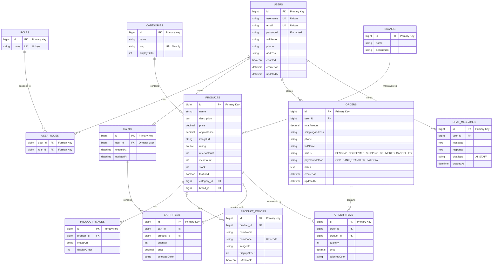

# Sơ Đồ Hệ Thống - Website Bán Xe Điện

## 1. Use Case Diagram (Tổng Quan Chức Năng)

```mermaid
graph TB
    subgraph System["Hệ Thống Bán Xe Điện"]
        direction TB
        
        UC_Login["🔐 Đăng Nhập"]
        UC_LoginPhone["📱 Đăng Nhập bằng SĐT"]
        UC_LoginEmail["📧 Đăng Nhập bằng Email"]
        
        UC_Order["💰 Đặt Hàng"]
        UC_OrderPhone["☎️ Đặt Hàng qua Điện Thoại"]
        UC_OrderWeb["🌐 Đặt Hàng qua Website<br/>extension point: Thông tin khách hàng"]
        UC_UpdateInfo["✏️ Cập Nhật Thông Tin Khách Hàng"]
        
        UC_Login -.->|include| UC_LoginPhone
        UC_Login -.->|include| UC_LoginEmail
        
        UC_Order -.->|include| UC_OrderPhone
        UC_Order -.->|include| UC_OrderWeb
        
        UC_UpdateInfo -.->|extend| UC_OrderWeb
    end
    
    subgraph Actors["Actors"]
        direction TB
        Customer["👤 Khách Hàng"]
        NewCustomer["👤 Khách Hàng Mới"]
        ExistingCustomer["👤 Khách Hàng Cũ"]
        ERP["💼 Hệ Thống ERP"]
    end
    
    Customer --> UC_Login
    Customer --> UC_Order
    
    NewCustomer --> UC_OrderPhone
    NewCustomer --> UC_OrderWeb
    
    ExistingCustomer --> UC_OrderWeb
    
    ERP --> UC_UpdateInfo
    
    Customer <|-- NewCustomer
    Customer <|-- ExistingCustomer
    
    style System fill:#fff9c4,stroke:#f9a825,stroke-width:3px
    style Customer fill:#e3f2fd,stroke:#1976d2,stroke-width:2px
    style NewCustomer fill:#c8e6c9,stroke:#388e3c,stroke-width:2px
    style ExistingCustomer fill:#fff3e0,stroke:#f57c00,stroke-width:2px
    style ERP fill:#f3e5f5,stroke:#7b1fa2,stroke-width:2px
    style UC_Login fill:#e1f5fe,stroke:#0277bd,stroke-width:2px
    style UC_LoginPhone fill:#e8f5e9,stroke:#388e3c,stroke-width:1px
    style UC_LoginEmail fill:#e8f5e9,stroke:#388e3c,stroke-width:1px
    style UC_Order fill:#fff3e0,stroke:#f57c00,stroke-width:2px
    style UC_OrderPhone fill:#fce4ec,stroke:#c2185b,stroke-width:1px
    style UC_OrderWeb fill:#fce4ec,stroke:#c2185b,stroke-width:1px
    style UC_UpdateInfo fill:#f3e5f5,stroke:#7b1fa2,stroke-width:2px
```

## 2. DFD Level 0 (Context Diagram)


## 3. Activity Diagram - Quy Trình Đặt Hàng

```mermaid
flowchart TD
    Start([🚀 Bắt Đầu]) --> Browse[🛍️ Khách Hàng Duyệt Sản Phẩm]
    Browse --> Select{Chọn Sản Phẩm?}
    Select -->|Không| Browse
    Select -->|Có| CheckLogin{Đã Đăng Nhập?}
    
    CheckLogin -->|Chưa| Login[🔐 Đăng Nhập/Đăng Ký]
    Login --> AddToCart[➕ Thêm Vào Giỏ Hàng]
    CheckLogin -->|Rồi| AddToCart
    
    AddToCart --> ViewCart[🛒 Xem Giỏ Hàng]
    ViewCart --> SelectColor[🎨 Chọn Màu Sắc]
    SelectColor --> UpdateCart{Cập Nhật<br/>Số Lượng?}
    UpdateCart -->|Có| ViewCart
    UpdateCart -->|Không| Checkout[💳 Tiến Hành Thanh Toán]
    
    Checkout --> FillInfo[📝 Điền Thông Tin Giao Hàng]
    FillInfo --> SelectPayment{Chọn Phương Thức<br/>Thanh Toán}
    
    SelectPayment -->|COD| CreateOrder1[📦 Tạo Đơn Hàng COD]
    SelectPayment -->|Chuyển Khoản| CreateOrder2[📦 Tạo Đơn Hàng<br/>Chuyển Khoản]
    SelectPayment -->|ZaloPay| ProcessPayment[💳 Xử Lý Thanh Toán<br/>ZaloPay]
    
    ProcessPayment --> PaymentResult{Kết Quả<br/>Thanh Toán?}
    PaymentResult -->|Thành Công ✅| CreateOrder3[📦 Tạo Đơn Hàng<br/>ZaloPay]
    PaymentResult -->|Thất Bại ❌| Checkout
    
    CreateOrder1 --> SendEmail[📧 Gửi Email Xác Nhận]
    CreateOrder2 --> SendEmail
    CreateOrder3 --> SendEmail
    
    SendEmail --> ClearCart[🗑️ Xóa Giỏ Hàng]
    ClearCart --> ShowSuccess[✅ Hiển Thị Thông Báo<br/>Thành Công]
    ShowSuccess --> End([🏁 Kết Thúc])
    
    style Start fill:#c8e6c9,stroke:#2e7d32,stroke-width:3px
    style End fill:#ffcdd2,stroke:#c62828,stroke-width:3px
    style CheckLogin fill:#fff9c4,stroke:#f57f17,stroke-width:2px
    style SelectPayment fill:#fff9c4,stroke:#f57f17,stroke-width:2px
    style PaymentResult fill:#fff9c4,stroke:#f57f17,stroke-width:2px
    style UpdateCart fill:#fff9c4,stroke:#f57f17,stroke-width:2px
    style Select fill:#fff9c4,stroke:#f57f17,stroke-width:2px
    style CreateOrder1 fill:#e1f5fe,stroke:#0277bd,stroke-width:2px
    style CreateOrder2 fill:#e1f5fe,stroke:#0277bd,stroke-width:2px
    style CreateOrder3 fill:#e1f5fe,stroke:#0277bd,stroke-width:2px
    style SendEmail fill:#f3e5f5,stroke:#7b1fa2,stroke-width:2px
```



## 4. Sequence Diagram - Quy Trình Đặt Hàng

```mermaid
sequenceDiagram
    autonumber
    participant C as 👤 Customer
    participant BC as 🌐 Browser/Client
    participant HC as 🏠 HomeController
    participant CS as 🛒 CartService
    participant PC as 💳 PaymentController
    participant OS as 📦 OrderService
    participant ES as 📧 EmailService
    participant DB as 🗄️ Database
    
    Note over C,DB: Bước 1: Thêm sản phẩm vào giỏ hàng
    C->>BC: Chọn sản phẩm, thêm vào giỏ hàng
    BC->>HC: POST /cart/add<br/>{productId, quantity, color}
    HC->>CS: addToCart(user, productId, quantity, color)
    CS->>DB: INSERT INTO cart_items
    DB-->>CS: CartItem saved
    CS-->>HC: Success
    HC-->>BC: Redirect to /cart
    BC-->>C: Hiển thị giỏ hàng
    
    Note over C,DB: Bước 2: Xem giỏ hàng và thanh toán
    C->>BC: Click "Thanh Toán"
    BC->>PC: GET /payment/checkout
    PC->>CS: getCartItems(user)
    CS->>DB: SELECT * FROM cart_items
    DB-->>CS: CartItems list
    CS-->>PC: CartItems
    PC-->>BC: Render checkout page
    BC-->>C: Form thanh toán
    
    Note over C,DB: Bước 3: Tạo đơn hàng
    C->>BC: Điền thông tin, submit
    BC->>PC: POST /payment/checkout<br/>{shippingInfo, paymentMethod}
    PC->>OS: createOrder(user, orderData)
    OS->>DB: BEGIN TRANSACTION
    OS->>DB: INSERT INTO orders
    OS->>DB: INSERT INTO order_items
    OS->>CS: clearCart(user)
    CS->>DB: DELETE FROM cart_items
    OS->>ES: sendOrderConfirmation(email, orderId)
    ES-->>C: Email xác nhận đơn hàng
    OS->>DB: COMMIT TRANSACTION
    OS-->>PC: Order created successfully
    PC-->>BC: Redirect to /payment/orders/{orderId}
    BC-->>C: Hiển thị chi tiết đơn hàng
```



## 5. Class Diagram


## 6. Database Diagram (ERD)



## 7. Deployment Diagram

```mermaid
graph TB
    subgraph Client["Client Layer"]
        Browser[🌐 Web Browser<br/>Chrome/Firefox/Edge<br/>Safari]
        Mobile[📱 Mobile Browser<br/>iOS/Android]
    end
    
    subgraph LB["Load Balancer Layer"]
        Nginx[⚖️ Nginx Load Balancer<br/>Port 80/443<br/>SSL Termination]
    end
    
    subgraph App["Application Layer"]
        App1[☕ Spring Boot App<br/>Instance 1<br/>Port 8080<br/>JVM Heap: 2GB]
        App2[☕ Spring Boot App<br/>Instance 2<br/>Port 8081<br/>JVM Heap: 2GB]
    end
    
    subgraph DB["Database Layer"]
        MySQL[(🗄️ MySQL Master<br/>Port 3306<br/>Read/Write)]
        MySQLSlave[(🗄️ MySQL Replica<br/>Port 3307<br/>Read Only)]
    end
    
    subgraph External["External Services"]
        ZaloPay[💳 ZaloPay API<br/>Payment Gateway<br/>HTTPS]
        SMTP[📧 SMTP Server<br/>Email Service<br/>Port 587]
    end
    
    subgraph Storage["Storage Layer"]
        FileStorage[📁 File Storage<br/>Product Images<br/>Static Assets]
    end
    
    Browser -->|HTTPS| Nginx
    Mobile -->|HTTPS| Nginx
    
    Nginx -->|HTTP| App1
    Nginx -->|HTTP| App2
    
    App1 -->|JDBC| MySQL
    App1 -->|JDBC Read| MySQLSlave
    App2 -->|JDBC| MySQL
    App2 -->|JDBC Read| MySQLSlave
    
    App1 -->|REST API| ZaloPay
    App2 -->|REST API| ZaloPay
    App1 -->|SMTP| SMTP
    App2 -->|SMTP| SMTP
    
    App1 -->|File I/O| FileStorage
    App2 -->|File I/O| FileStorage
    
    MySQL -.->|Replication| MySQLSlave
    
    style Browser fill:#e3f2fd,stroke:#1976d2,stroke-width:2px
    style Mobile fill:#e3f2fd,stroke:#1976d2,stroke-width:2px
    style Nginx fill:#fff3e0,stroke:#f57c00,stroke-width:3px
    style App1 fill:#c8e6c9,stroke:#388e3c,stroke-width:2px
    style App2 fill:#c8e6c9,stroke:#388e3c,stroke-width:2px
    style MySQL fill:#f3e5f5,stroke:#7b1fa2,stroke-width:3px
    style MySQLSlave fill:#f3e5f5,stroke:#7b1fa2,stroke-width:2px
    style ZaloPay fill:#fff9c4,stroke:#f9a825,stroke-width:2px
    style SMTP fill:#e1f5fe,stroke:#0277bd,stroke-width:2px
    style FileStorage fill:#fce4ec,stroke:#c2185b,stroke-width:2px
```



## Mô Tả Chi Tiết Các Sơ Đồ

### 1. Use Case Diagram
- **Actors**: 3 loại người dùng với các quyền khác nhau
- **Use Cases**: 23 chức năng được phân loại theo từng actor
- **Màu sắc**: Mỗi actor và nhóm use case có màu riêng để dễ phân biệt

### 2. DFD Level 0 (Context Diagram)
- Mô tả luồng dữ liệu giữa hệ thống và các thực thể bên ngoài
- Đánh số các luồng dữ liệu để dễ theo dõi

### 3. Activity Diagram
- Quy trình đặt hàng từ đầu đến cuối
- Các điểm quyết định được đánh dấu rõ ràng
- Màu sắc phân biệt các loại hoạt động

### 4. Sequence Diagram
- Tương tác chi tiết giữa các thành phần
- Đánh số các bước để dễ theo dõi
- Hiển thị các thông điệp với format rõ ràng

### 5. Class Diagram
- Cấu trúc đầy đủ các lớp với thuộc tính và phương thức
- Mối quan hệ giữa các lớp được thể hiện rõ ràng
- Services và Models được phân biệt

### 6. Database Diagram (ERD)
- Tất cả 13 bảng với các trường chi tiết
- Mối quan hệ Foreign Key được đánh dấu
- Các ràng buộc và kiểu dữ liệu được ghi chú

### 7. Deployment Diagram
- Kiến trúc triển khai đầy đủ với các thành phần
- Port numbers và cấu hình được ghi chú
- Màu sắc phân biệt các layer khác nhau
